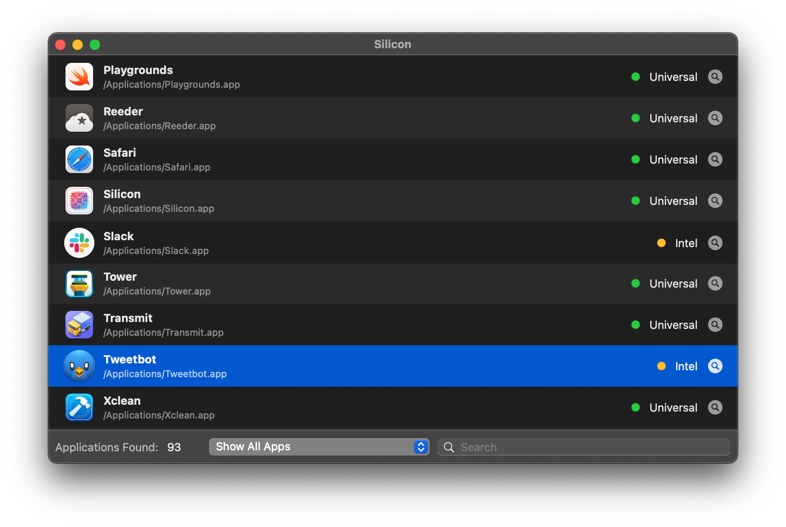

Silicon
=======

  

About
-----

Identify Intel-Only Apps on your Mac with ease:

License
-------

Project is released under the terms of the MIT License.

Repository Infos
----------------

    Owner:          DigiDNA SARL
    Web:            www.imazing.com
    Blog:           blog.imazing.com
    Twitter:        @DigiDNA
    GitHub:         github.com/DigiDNA
